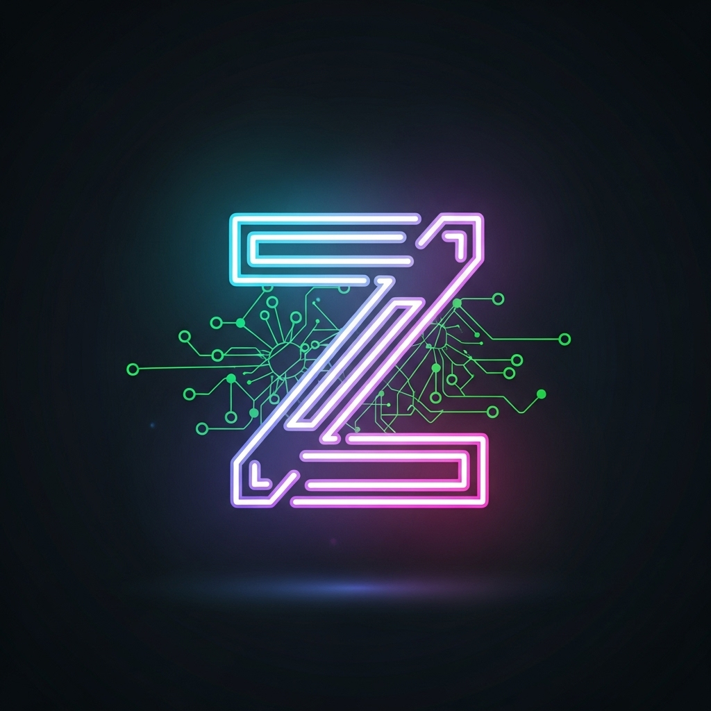
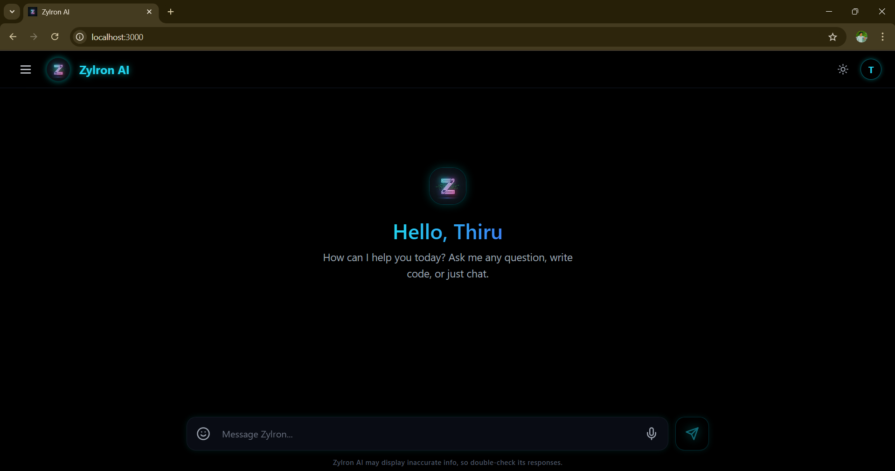
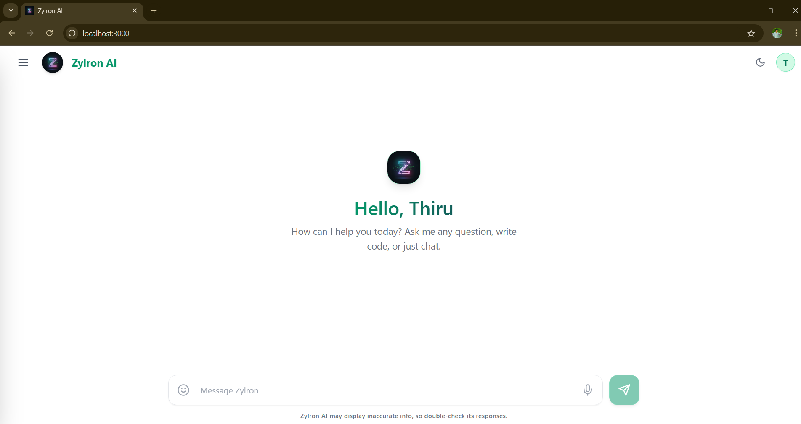
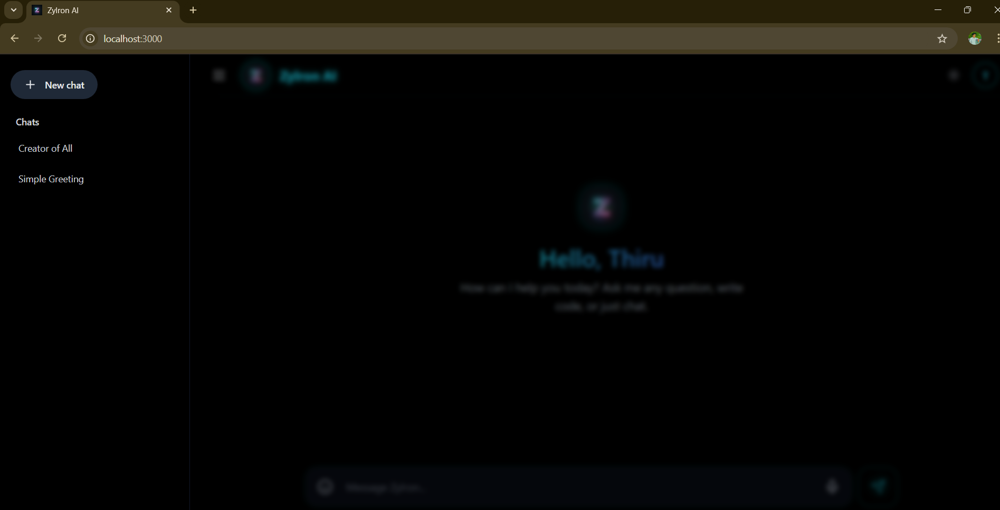

# 🚀 Zylron AI - Advanced Conversational Assistant

 
*Zylron AI* is a cutting-edge, full-stack AI chat application built with a modern React interface. Inspired by the sleek design of Google Gemini, Zylron AI runs purely on local intelligence using Llama 3 via Ollama, ensuring 100% privacy and high-performance offline capabilities. 

Created with ❤️ by **Thirumalai**.

---

## ✨ Key Features

* **📱 Premium Gemini-Clone UI:** A beautifully crafted, responsive interface with a fully collapsible sidebar and smooth transitions.
* **🌗 Dynamic Theme Toggle:** Seamlessly switch between a crisp Light Mode and a futuristic Dark Mode with custom neon accents.
* **🧠 Smart AI Chat Titles:** Automatically generates context-aware, 2-4 word chat titles in the background based on your first prompt (just like ChatGPT).
* **🎙️ Voice Input Ready:** Integrated microphone button with futuristic glowing pulse animations for voice-to-text queries.
* **⌨️ Typewriter Effect:** Responses stream in naturally, letter-by-letter, simulating a real-time thinking assistant.
* **💾 Session Persistence:** Chat history is saved and retrieved flawlessly, so you never lose your conversations.
* **🤖 Custom Personality Engine:** Powered by a customized system prompt, the AI strictly identifies as "Zylron AI," tailored to assist with programming, logic, and general queries.

---

## 🛠️ Tech Stack

**Frontend:**
* React.js (Vite)
* Tailwind CSS (Glassmorphism & Custom Theming)
* React Hooks (State Management)

**Backend / AI Engine:**
* Node.js & Express.js
* Ollama (Local LLM Integration running *Llama 3*)
* MongoDB / LocalStorage (For Chat History)

---

## 📸 Sneak Peek (Screenshots)


* **Dark Mode & Chat Interface:** 
* **Light Mode & Sidebar:** 
* **Smart Chat Titles in Action:** 

---

## 🚀 Getting Started (Run Locally)

Want to run Zylron AI on your own machine? Follow these steps:

### Prerequisites:
1. Node.js installed.
2. [Ollama](https://ollama.com/) installed and running on your machine.
3. Pull the Llama 3 model: 
   ```bash
   ollama run llama3
   ```

### Installation:
1. Clone this repository:
   ```bash
   git clone https://github.com/yourusername/zylron-ai.git
   ```
2. Set up Backend & Frontend variables.
3. Run `npm install` and start the clients.

*(Further backend and frontend usage instructions go here).*
